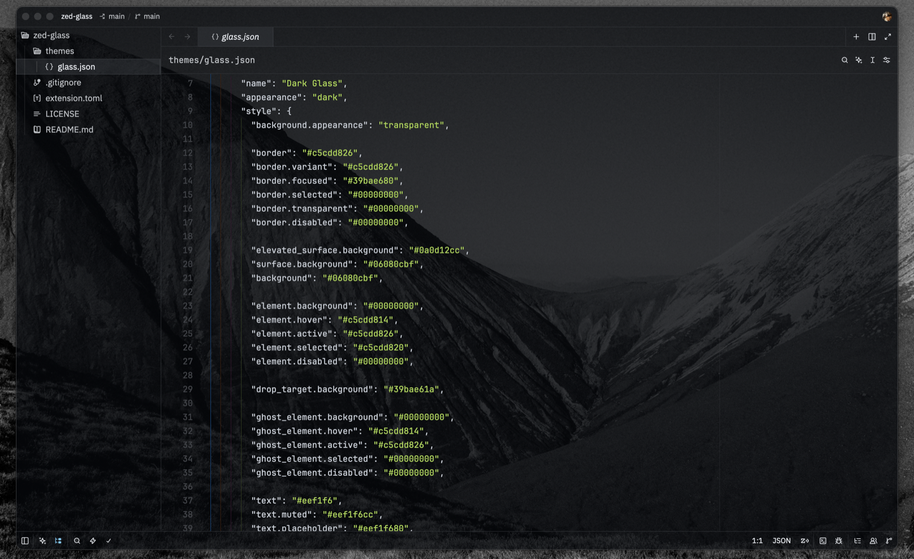
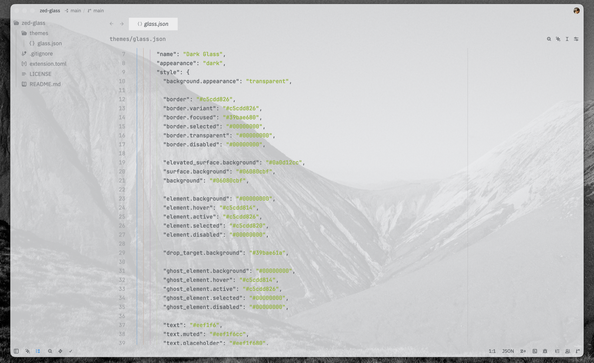

# Glass


A liquid-glass theme for [Zed](https://zed.dev) — a transparent, frosted look that
lets your desktop show through the editor, tree, and terminal as one continuous pane.

Ships two variants:

- **Dark Glass** — transparent dark glass (primary).
- **Light Glass** — transparent light glass.

## Screenshots

| Dark Glass | Light Glass |
| --- | --- |
|  |  |

> **Note:** transparency requires a transparent window background. This works over your
> desktop wallpaper; the effect is strongest over an even or lighter area.

## How it works

The tint lives in a single window background; the editor, project panel, tabs,
breadcrumbs, and terminal are all transparent and read through it. This keeps every
surface the exact same tone — no seams, no double-darkened docks — and gives the file
tree a real backdrop instead of bare wallpaper.

Transparency looks best over an even or lighter area of your wallpaper; glass over a
very dark region will naturally read dark, since there is little for it to reveal.

## Installation

### From the Zed extension registry

`Cmd+Shift+X` → search **Glass** → Install. Then `Cmd+K Cmd+T` → **Dark Glass** / **Light Glass**.

### As a dev extension (local)

`Cmd+Shift+X` → **Install Dev Extension** → select this repository's root. Zed picks up
`themes/glass.json` automatically.

### Manual (theme file only)

```bash
mkdir -p ~/.config/zed/themes
cp themes/glass.json ~/.config/zed/themes/
```

Restart Zed and select the theme with `Cmd+K Cmd+T`.

## Requirements

Transparency requires a transparent window background, which is set by the theme
(`background.appearance: "transparent"`). Changing that mode takes full effect only after
a complete restart of Zed (`Cmd+Q`), not a live theme reload.

## Tuning transparency

The dark theme's tint is a single window background — `background` and
`surface.background` (`#06080cbf`, ~75%). Edit the last two hex digits (alpha) to make the
whole UI lighter or darker at once.

- `title_bar` / `status_bar` are painted over the desktop (not over content), so they are
  given the same color explicitly — keep them in sync when you change the alpha.
- Other surfaces (`editor.background`, `panel.background`, `tab_bar`, `terminal.background`)
  are transparent (`#00000000`) and show the shared background.
- `panel.background` is kept transparent on purpose: Zed paints the project panel row by
  row, so a semi-transparent value produces seams between rows. The tree tone comes from
  the shared background instead — no seams.

## Known Zed limitations

- Custom themes reload on restart; switching `background.appearance` requires a full `Cmd+Q`.
- Zed does not yet support different transparency per panel
  ([issue #9620](https://github.com/zed-industries/zed/issues/9620)) — opacity is uniform
  across the window.

## License

[MIT](LICENSE)
